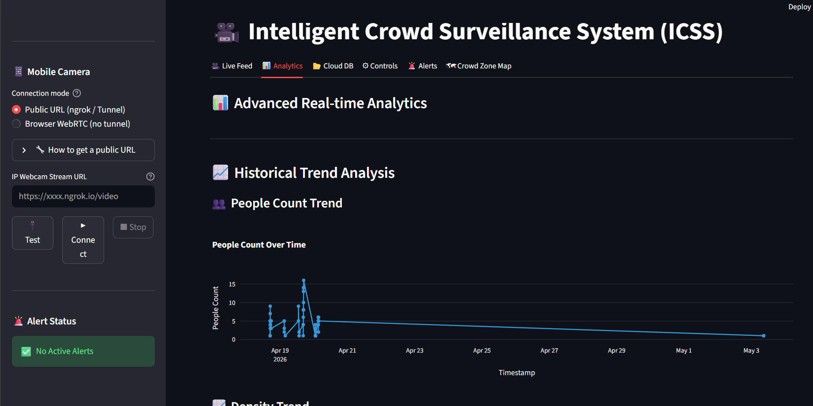
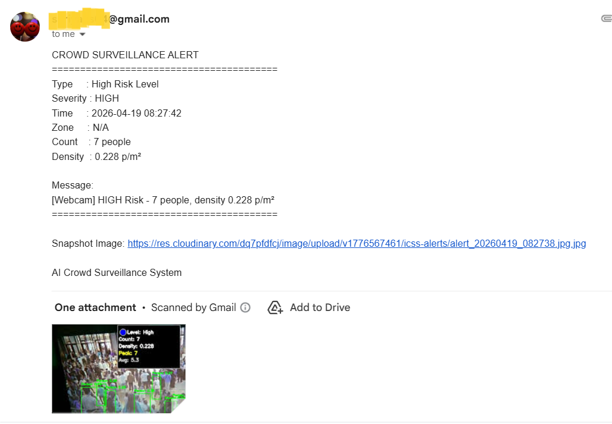
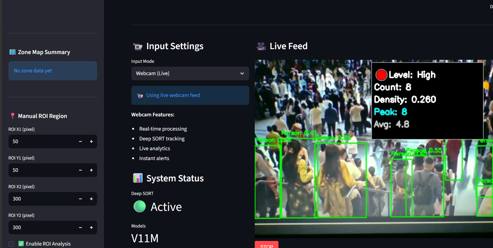
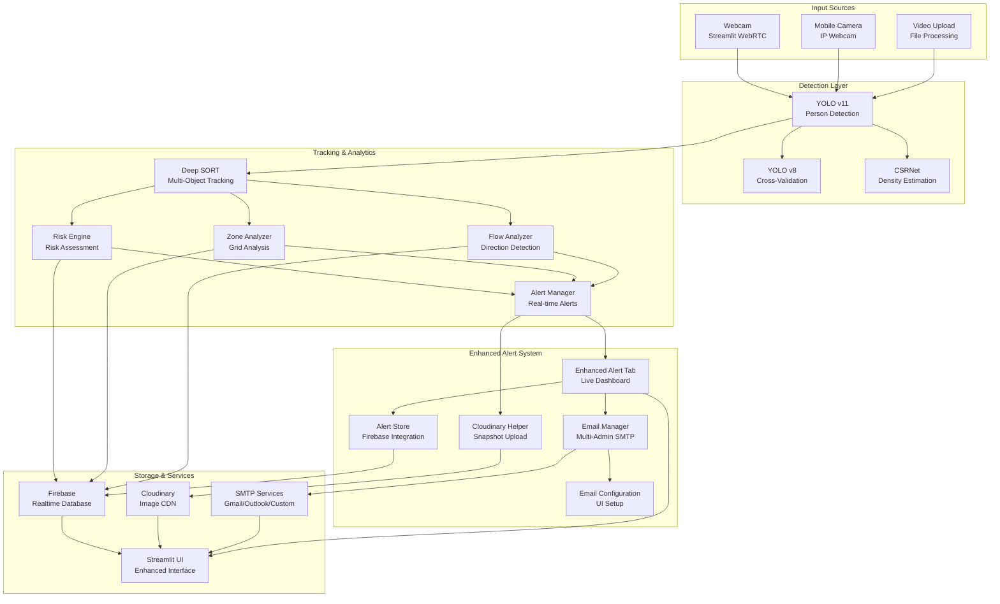

# CrowdIQ — Intelligent Crowd Surveillance System(ICSS)

Real-time AI-powered crowd monitoring, density estimation, and risk assessment for intelligent surveillance and crowd management.


---

## Overview

CrowdIQ uses dual YOLO models (v11 + v8) and CSRNet for real-time person detection, crowd counting, and density estimation. It features Deep SORT tracking, zone-based risk analysis, multi-admin email alert and Firebase cloud storage. Designed for security teams, event organizers, and facility managers needing intelligent crowd monitoring.

---

## Screenshots





---

## Features

- **Dual YOLO Detection**: YOLO v11 + v8 cross-validation for enhanced accuracy
- **Deep SORT Tracking**: Multi-object tracking with trajectory analysis
- **CSRNet Density Maps**: Neural network-based heatmap generation for dense crowds
- **Zone-Based Analysis**: Grid-based risk highlighting with overcrowding alerts
- **Real-Time Alerts**: Multi-admin email notifications with automatic snapshots
- **Multiple Input Sources**: Webcam, mobile camera (IP Webcam), video upload
- **Firebase Integration**: Cloud database for analytics and alert history
- **Smart Risk Engine**: Weighted scoring (density, flow conflict, speed variation)
- **Physics-Based Flow Analysis**: Congestion detection and flow direction
- **Professional UI**: Streamlit interface with real-time monitoring

---

## Tech Stack

| Category | Technologies |
|----------|-------------|
| Frontend | Streamlit, Streamlit WebRTC |
| Computer Vision | OpenCV, YOLO v11, YOLO v8, CSRNet |
| Tracking | Deep SORT |
| AI/ML | PyTorch, Ultralytics |
| Database | Firebase Realtime Database |
| Cloud Storage | Cloudinary |
| Email | SMTP (Gmail/Outlook/Custom) |
| Visualization | Plotly, Matplotlib, Seaborn |

---
## System Architecture

### Architecture Overview
1. **Input Layer**: Multiple input sources (Webcam, Mobile Camera via IP Webcam, Video Upload)
2. **Detection Layer**: Dual YOLO models (v11 + v8) for person detection, CSRNet for dense crowd density estimation
3. **Tracking & Analytics Layer**: Deep SORT for tracking, Risk Engine for assessment, Zone/Flow analyzers for spatial analysis
4. **Enhanced Alert System**: Comprehensive alert management with live dashboard, multi-admin email, snapshot capture, and professional formatting
5. **Storage & Services Layer**: Firebase Realtime Database for cloud analytics, Cloudinary for image CDN, SMTP services for email delivery
6. **Visualization Layer**: Enhanced Streamlit UI with real-time monitoring and comprehensive configuration options
### New Architecture Components
#### **Enhanced Alert System Layer**
- **Enhanced Alert Tab**: Live dashboard with auto-refresh and real-time monitoring
- **Alert Store**: Firebase integration for persistent alert storage and retrieval
- **Email Manager**: Multi-administrator SMTP support with Gmail/Outlook/Custom providers
- **Cloudinary Helper**: Automatic snapshot capture and CDN upload on alert trigger
- **Email Configuration**: Complete UI-based SMTP setup and recipient management
#### **Storage & Services Layer**
- **Firebase Realtime Database**: Cloud database for analytics, metrics, and alert history
- **Cloudinary**: Image CDN for alert snapshots with automatic cleanup
- **SMTP Services**: Email delivery through Gmail, Outlook, or custom SMTP servers
- **Enhanced UI**: Streamlit interface with comprehensive alert management
#### **Data Flow Enhancements**
- **Alert Trigger**: Risk engine and zone analyzer feed enhanced alert system
- **Snapshot Capture**: Automatic image upload to Cloudinary on alert events
- **Email Delivery**: Multi-admin notifications with professional formatting
- **Real-time Updates**: Live dashboard with auto-refresh every 3 seconds
- **Configuration Management**: UI-based setup for all email and alert parameters
---

## Quick Start

1. **Clone the repository**
   ```bash
   git clone https://github.com/SURIYA-PRAKASH-E-S/CrowdIQ.git
   cd CrowdIQ
   ```

2. **Create virtual environment**
   ```bash
   python -3.10 -m venv venv
   # Windows: venv\Scripts\activate
   # Linux/macOS: source venv/bin/activate
   ```

3. **Install dependencies**
   ```bash
   pip install -r requirements.txt
   ```

4. **Configure environment variables**
   ```bash
   cp env_example.txt .env
   # Edit .env with your credentials
   ```

5. **Run the application**
   ```bash
   streamlit run app.py
   ```

---

## Configuration

```env
# Firebase Realtime Database
FIREBASE_DATABASE_URL=https://your-project-id-default-rtdb.firebaseio.com
GOOGLE_APPLICATION_CREDENTIALS=firebase-service-account.json

# SMTP Email Configuration
SMTP_HOST=smtp.gmail.com
SMTP_PORT=587
SMTP_USE_TLS=true
SMTP_USERNAME=your-email@gmail.com
SMTP_PASSWORD=your-app-password

# Cloudinary (for alert snapshots)
CLOUDINARY_CLOUD_NAME=your-cloud-name
CLOUDINARY_API_KEY=your-api-key
CLOUDINARY_API_SECRET=your-api-secret
```

See [setup.md](setup.md) for complete setup guides.

---

## Datasets Links

- [YOLOv11 custom dataset](https://universe.roboflow.com/suriyaes/crowd-dataset1/dataset/5)
- [YOLOv8 hajj dataset](https://universe.roboflow.com/hajj-iabgo/hajjv2)

---

## Alert System

Real-time alerts with multi-admin email notifications and automatic snapshot capture via Cloudinary. Supports severity levels (LOW/MEDIUM/HIGH/CRITICAL) and zone-based overcrowding detection.

**Example Alert Email:**
```
ICSS ALERT NOTIFICATION
==================================================
ALERT TYPE: Zone Overcrowding
SEVERITY: CRITICAL
TIME: 2024-04-16 11:47:30

MESSAGE: Zone A overcrowded! 35 people, 1.200 p/m²
SNAPSHOT: https://res.cloudinary.com/icss-alerts/alert.jpg
==================================================
```

---

## Risk Levels

| Level | Color | Condition |
|-------|-------|-----------|
| Normal | Green | Density < 0.5 p/m², Count < 8 |
| Average | Yellow | Density 0.5-1.0 p/m², Count 8-15 |
| Risky | Red | Density > 1.0 p/m², Count > 15 |

---

## Crowd Zone Map

Interactive geospatial simulation for crowd zone analysis with manual polygon input and density-based capacity planning.

**Features:**
- **Manual Polygon Input**: Define zone corners with latitude/longitude coordinates
- **Area Calculation**: Shoelace formula adapted for lat/lon coordinates
- **Density Scenarios**: Select from Crush (0.09 m²), Very Dense (0.25 m²), Safe Crowd (0.5 m²), Comfortable (1.0 m²)
- **Safe Capacity**: Automatically calculated based on selected density scenario
- **Live Simulation Map**: Folium-based interactive map with color-coded density overlay
- **Grid Visualization**: 1m x 1m grid showing crowd count distribution
- **Live Location Marker**: Real-time position tracking on map
- **Dual Mode**: Live detection mode (uses real-time people count) and manual simulation mode
- **Alert Integration**: Automatic alerts when safe capacity is exceeded

**Density Scenarios:**
- 🚨 Crush (Danger): 0.09 m²/person (~11 people/m²)
- ⚠️ Very Dense: 0.25 m²/person (~4 people/m²)
- ✅ Safe Crowd: 0.5 m²/person (~2 people/m²)
- 🟢 Comfortable: 1.0 m²/person (~1 person/m²)

---

## Project Structure

```
CrowdIQ/
├── app.py                      # Main Streamlit application
├── camera1.py                  # Mobile camera streaming
├── requirements.txt            # Python dependencies
├── model/                      # AI model files
│   ├── yolo11l.pt
│   └── V8l-haj.pt
├── utils/                      # Utility modules
│   ├── detection.py
│   ├── tracker.py
│   ├── risk_engine.py
│   ├── alert_manager.py
│   └── ...
└── components/                 # UI components
```

---

## Troubleshooting

| Issue | Solution |
|-------|----------|
| Camera not detected | Check browser permissions, try different input mode |
| Firebase connection error | Verify .env credentials, check service account file |
| Email not sending | Enable 2FA, generate App Password (Gmail) |
| Model loading error | Ensure model files exist in model/ directory |
| Low FPS | Disable CSRNet, use single YOLO model |

---

## License

MIT License — see LICENSE file for details.

---

***Built with Streamlit · YOLO · PyTorch · OpenCV***

