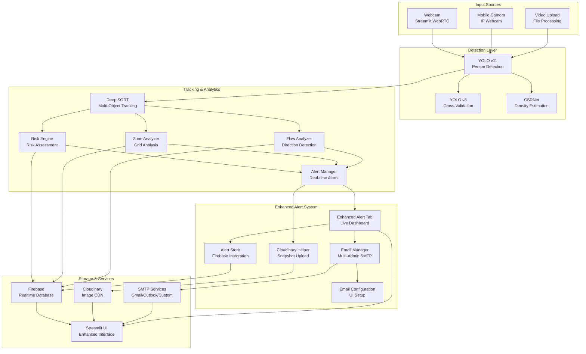

# 🎥 Intelligent Crowd Surveillance System (ICSS)

A comprehensive real-time crowd monitoring and analysis system powered by AI/ML for intelligent surveillance, risk assessment, and crowd management.

**🔗 Live Demo**: [ICSS]()

---

## 📋 Table of Contents

- [Overview](#overview)
- [Features](#features)
- [Tech Stack](#tech-stack)
- [System Architecture](#system-architecture)
- [Project Structure](#project-structure)
- [Installation](#installation)
- [How to Run](#how-to-run)
- [User Interface](#user-interface)
- [Configuration](#configuration)
- [Enhanced Alert System](#enhanced-alert-system)
- [Email Setup Guide](#email-setup-guide)
- [Risk Level System](#risk-level-system)
- [Dense Crowd Detection](#dense-crowd-detection)
- [Performance](#performance)
- [Troubleshooting](#troubleshooting)
- [Dependencies](#dependencies)

---

## Overview

**Intelligent Crowd Surveillance System** is a real-time computer vision application designed for intelligent crowd monitoring, density estimation, and risk assessment. It combines multiple AI models (YOLO, CSRNet) for enhanced detection accuracy in both normal and dense crowd scenarios.

### Key Highlights
- **Dual YOLO Model System** - YOLO v11 + YOLO v8 for cross-validation
- **Mobile Camera Support** - IP Webcam integration for flexible positioning
- **Dense Crowd Detection** - Enhanced detection for crowded scenes
- **Density Estimation** - CSRNet neural network for heatmap generation
- **Zone-based Analysis** - Grid-based risk highlighting
- **Advanced Analytics** - Intelligent risk assessment, flow analysis
- **Cloud Storage** - Firebase Realtime Database for cloud analytics and data persistence
- **Enhanced Alert System** - Real-time alerts with email notifications and snapshots
- **Multi-Admin Email Setup** - Support for multiple administrators and security teams
- **Cloudinary Integration** - Automatic snapshot capture and CDN storage
- **Real-time Alert Dashboard** - Live alert monitoring with auto-refresh
- **Manual Alert Controls** - Customizable alert levels and thresholds
- **Camera Source Detection** - Different alert handling for mobile vs webcam
- **SMS Feature Coming Soon** - Planned SMS notifications for critical alerts

---

## Features

### Core Detection Features
- **Person Detection**: High-precision YOLO v11/v8 models
- **Crowd Counting**: Real-time people counting
- **Density Estimation**: Normalized people per pixel area
- **Movement Tracking**: Deep SORT multi-object tracking
- **Flow Analysis**: Direction detection (Left/Right/Up/Down/Mixed)
- **Risk Assessment**: 3-tier classification (Normal/Average/Risky)

### Input Sources
- **Webcam (Live)**: Real-time camera feed via Streamlit WebRTC
- **Mobile Camera (IP Webcam)**: WiFi streaming from mobile device
- **Video Upload**: Process pre-recorded video files

### Dense Crowd Detection
- **CSRNet Density Maps**: Neural network-based density heatmap generation
- **Zone Grid Highlighting**: Color-coded risk zones (Green/Yellow/Red)
- **Enhanced Detection**: Optimized detection for crowded scenes

### Enhanced Alert System
- **Real-time Alerts**: Automatic risk detection and notification
- **Multi-Admin Email Notifications**: Support for unlimited administrators
- **Email Configuration UI**: Complete SMTP setup in app interface
- **Cloudinary Snapshot Integration**: Automatic image capture with alerts
- **Live Alert Dashboard**: Real-time alert monitoring with auto-refresh
- **Alert History**: Complete tracking and management of alert events
- **Severity-Based Filtering**: Different alert levels for different scenarios
- **Zone Overcrowding Alerts**: Per-zone capacity monitoring
- **Crowd Surge Detection**: Rapid crowd increase alerts
- **High Risk Level Alerts**: Global risk assessment notifications
- **Mobile Camera Mode**: Medium-risk alerts only for mobile feeds
- **Professional Email Format**: Structured alerts with detailed information
- **Test Email Function**: Verify email configuration before deployment
- **Manual Alert Controls**: Customizable alert levels (LOW/MEDIUM/HIGH/CRITICAL)
- **Manual Threshold Settings**: Adjustable density and people count thresholds
- **Camera Source Detection**: Different alert handling for mobile vs webcam
- **SMS Alerts (Coming Soon)**: Planned SMS notifications for critical alerts
- **Alert Priority System**: Manual settings override automatic detection
- **Real-time Settings Application**: Immediate effect of manual changes

### Advanced Analytics
- **Smart Risk Engine**: Weighted risk scoring (density, flow conflict, speed)
- **Zone Monitoring**: Grid-based area analysis with overcrowding alerts
- **Flow Pattern Detection**: Bidirectional conflict and surge detection
- **Speed Estimation**: Real-time velocity calculations

### User Interface
- **Tabbed Interface**: Live Feed, Analytics, Map Area, Local DB, Controls, Alerts
- **Real-time Overlays**: Bounding boxes, heatmaps, zone boundaries
- **Configurable Settings**: Thresholds, weights, grid sizes
- **Data Export**: Download analytics data
- **Mobile Camera Controls**: Sidebar configuration for IP Webcam
- **Manual Alert Controls**: Customizable alert levels and thresholds
- **Email Configuration UI**: Complete SMTP setup interface
- **Live Alert Dashboard**: Real-time monitoring with auto-refresh
- **Alert Statistics**: Comprehensive alert metrics and status

---

## Tech Stack

| Category | Technologies |
|----------|-------------|
| **Frontend** | Streamlit, Streamlit WebRTC |
| **Computer Vision** | OpenCV, YOLO v11, YOLO v8 |
| **AI/ML** | PyTorch, Ultralytics, CSRNet |
| **Tracking** | Deep SORT |
| **Database** | Firebase Realtime Database (cloud analytics) |
| **Email Services** | SMTP, Gmail, Outlook, Custom SMTP |
| **Cloud Storage** | Cloudinary (image CDN) |
| **Video Processing** | PyAV (av library) |
| **Visualization** | Plotly, Matplotlib, Seaborn |
| **Data Processing** | NumPy, Pandas, SciPy |

---

## System Architecture



### Architecture Overview

1. **Input Layer**: Multiple input sources (Webcam, Mobile Camera via IP Webcam, Video Upload)
2. **Detection Layer**: Dual YOLO models (v11 + v8) for person detection, CSRNet for dense crowd density estimation
3. **Tracking & Analytics Layer**: Deep SORT for tracking, Risk Engine for assessment, Zone/Flow analyzers for spatial analysis
4. **Enhanced Alert System**: Comprehensive alert management with live dashboard, multi-admin email, snapshot capture, and professional formatting
5. **Storage & Services Layer**: Firebase Realtime Database for cloud analytics, Cloudinary for image CDN, SMTP services for email delivery
6. **Visualization Layer**: Enhanced Streamlit UI with real-time monitoring and comprehensive configuration options

### New Architecture Components

#### **Enhanced Alert System Layer**
- **Enhanced Alert Tab**: Live dashboard with auto-refresh and real-time monitoring
- **Alert Store**: Firebase integration for persistent alert storage and retrieval
- **Email Manager**: Multi-administrator SMTP support with Gmail/Outlook/Custom providers
- **Cloudinary Helper**: Automatic snapshot capture and CDN upload on alert trigger
- **Email Configuration**: Complete UI-based SMTP setup and recipient management

#### **Storage & Services Layer**
- **Firebase Realtime Database**: Cloud database for analytics, metrics, and alert history
- **Cloudinary**: Image CDN for alert snapshots with automatic cleanup
- **SMTP Services**: Email delivery through Gmail, Outlook, or custom SMTP servers
- **Enhanced UI**: Streamlit interface with comprehensive alert management

#### **Data Flow Enhancements**
- **Alert Trigger**: Risk engine and zone analyzer feed enhanced alert system
- **Snapshot Capture**: Automatic image upload to Cloudinary on alert events
- **Email Delivery**: Multi-admin notifications with professional formatting
- **Real-time Updates**: Live dashboard with auto-refresh every 3 seconds
- **Configuration Management**: UI-based setup for all email and alert parameters

---

## Project Structure

```
ICSS
|-- app.py                      # Main Streamlit application
|-- camera1.py                  # Mobile camera streaming (IP Webcam)
|-- requirements.txt            # Python dependencies
|-- README.md                   # Project documentation
|-- alert.md                    # Alert system setup guide
|-- doubts.md                   # FAQ and troubleshooting guide
|-- enhanced_alert_setup.md     # Enhanced alert system guide
|-- email_setup_guide.md        # Complete email setup guide
|-- env_example.txt              # Environment variables template
|-- crowd_data.db               # Local cache database (backup)
|
|-- model/                      # AI model files
|   |-- yolo11l.pt                  # YOLO v11 (51MB)
|   |-- V8l-haj.pt              # YOLO v8 (87MB)
|   -- yolo11m.pt              # YOLO v11 medium (optional)
|
|-- components/                 # UI components
|   -- alert_tab.py             # Enhanced alert tab component
|
|-- utils/                      # Utility modules
|   |-- detection.py            # Detection pipeline
|   |-- tracker.py              # Deep SORT tracking
|   |-- advanced_analytics.py   # Analytics integration
|   |-- risk_engine.py          # Risk assessment
|   |-- zone_analyzer.py        # Zone monitoring
|   |-- flow_analyzer.py        # Flow analysis
|   |-- csrnet_density.py       # CSRNet density estimation
|   |-- crowd_visualization.py  # Visualization components
|   |-- crowd_analytics.py      # Crowd behavior analysis
|   |-- alert_manager.py        # Real-time alert system
|   |-- alert_store.py          # Enhanced alert storage (Firebase)
|   |-- email_config.py         # Email configuration and management
|   |-- cloudinary_helper.py    # Cloudinary image upload helper
|   -- database.py              # Firebase integration
```

---

## Installation

### Prerequisites
- Python 3.8 or higher
- Webcam or video files for testing
- (Optional) NVIDIA GPU for faster inference

### Step 1: Clone/Download Project

```bash
git clone  https://github.com/SURIYA-PRAKASH-E-S/ICSS.git 
cd ICSS
```

### Step 2: Create Virtual Environment

```bash
# Create virtual environment
python -3.10 -m venv venv

# Activate virtual environment
# Windows:
venv\Scripts\activate
# Linux/macOS:
source venv/bin/activate
```

### Step 3: Install Dependencies

```bash
pip install -r requirements.txt
```

### Dependencies List
```
streamlit
streamlit-webrtc
opencv-python
ultralytics
numpy
av
duckdb
plotly
pandas
torch
torchvision
scipy
scikit-learn
matplotlib
seaborn
```

### Step 4: Verify Models

Ensure YOLO models are in the `model/` directory:
- `model/yolo11l.pt` (51MB)
- `model/V8l-haj.pt` (87MB)

### Step 5: Configure Alert System (IMPORTANT)

**The alert system requires configuration to work properly:**

1. **Setup Environment Variables**
   ```bash
   cp env_example.txt .env
   ```
   Edit `.env` with your Gmail and SMS credentials

2. **Configure Email Alerts** (Required for notifications)
   - Gmail 2FA must be enabled
   - Generate App Password (not regular password)
   - See `alert.md` for detailed setup

3. **Configure SMS Alerts** (Optional)
   - Add phone number and carrier to `.env`
   - Only CRITICAL alerts trigger SMS

**⚠️ Without proper configuration, alerts will not be sent!**

---

## How to Run

### Start the Application

```bash
streamlit run app.py
```

### Access the Application

After running, you'll see:

```
You can now view your Streamlit app in your browser.

Local URL: http://localhost:8501
Network URL: http://192.168.1.4:8501
```

Open **http://localhost:8501** in your browser.

### Quick Start Guide

1. **Select Input Mode** (Tab 1: Live Feed)
   - Choose "Webcam (Live)" for real-time camera feed
   - Choose "Mobile Camera (IP Webcam)" for WiFi streaming from phone
   - Or "Upload Video" to process a video file

2. **Start Processing**
   - Click "Start" to begin video processing
   - View real-time detections and overlays

3. **Monitor Analytics** (Tab 2: Analytics)
   - View people count, density, flow direction
   - Check risk level and alerts

4. **View Zone Analysis** (Tab 3: Map Area)
   - Visualize zone-based risk distribution
   - Monitor overcrowded areas

5. **View Historical Data** (Tab 4: Cloud DB)
   - Check stored analytics from Firebase cloud database
   - View trends and statistics

6. **Configure Settings** (Tab 5: Controls)
   - Enable/disable detection features
   - Adjust thresholds and parameters

7. **Manage Alerts** (Tab 6: Alerts)
   - View active and historical alerts
   - Configure alert thresholds

---

## User Interface

### Tab 1: 🎥 Live Feed

| Feature | Description |
|---------|-------------|
| Input Selection | Webcam, Mobile Camera (IP Webcam), or Video Upload |
| Real-time Processing | Live video with AI overlays |
| Performance Info | FPS, model status, optimization mode |
| Visual Overlays | Bounding boxes, risk levels, flow arrows |
| Alert System | Color-coded risk warnings |

### Tab 2: 📊 Analytics

| Feature | Description |
|---------|-------------|
| Real-time Metrics | People count, density, flow, risk |
| Advanced Analytics | Risk engine, zone analysis, flow patterns |
| Risk Assessment | Color-coded indicators and alerts |
| Model Performance | Detection statistics and model status |

### Tab 3: Map Area

| Feature | Description |
|---------|-------------|
| Zone Grid | Visual representation of risk zones |
| Zone Details | Per-zone people count and density |
| Zone Alerts | Overcrowding and violation warnings |

### Tab 4: 📂 Cloud DB

| Feature | Description |
|---------|-------------|
| Current Metrics | Latest database values |
| Historical Trends | Last 10 records table |
| Statistics | Average values and risk distribution |
| Database Info | Record count and storage details |

### Tab 5: ⚙️ Controls

| Feature | Description |
|---------|-------------|
| Model Selection | YOLO v11/v8 toggle |
| Deep SORT Toggle | Multi-object tracking control |
| Advanced Analytics | Risk, zone, flow analysis toggles |
| Dense Crowd Detection | CSRNet settings |
| Threshold Settings | Density and count risk levels |
| Risk Weights | Configurable assessment parameters |
| Zone Configuration | Grid size and restricted zones |
| Mobile Camera | IP Webcam connection settings |

### Tab 6: 🚨 Alerts

| Feature | Description |
|---------|-------------|
| Manual Alert Controls | Customizable alert levels and thresholds |
| Email Configuration | Complete SMTP setup for multiple administrators |
| Active Alerts | Current critical and warning alerts |
| Alert History | Past alert events log |
| Alert Statistics | Comprehensive metrics and status display |
| Live Alert Dashboard | Real-time monitoring with auto-refresh |
| SMS Configuration | Planned SMS notifications (coming soon) |

---

## Configuration

### ⚠️ IMPORTANT: Alert System Configuration

**The alert system (Email/SMS) requires proper configuration to function correctly.**

#### Required Configuration Steps:

1. **Environment Setup** (CRITICAL)
   ```bash
   # Copy environment template
   cp env_example.txt .env
   
   # Edit .env with your credentials
   # See alert.md for detailed setup guide
   ```

2. **Email Alert Setup** (Required for email notifications)
   - Gmail 2FA must be enabled
   - Generate App Password (not regular password)
   - Configure SMTP credentials in .env file
   - Enable email alerts in Alerts tab

3. **Manual Alert Configuration** (Optional, for custom alert levels)
   - Set alert levels: LOW, MEDIUM, HIGH, CRITICAL
   - Configure density thresholds (0.1-2.0 p/m²)
   - Set people count thresholds (1-50 people)
   - Apply settings in Alerts tab for immediate effect

4. **SMS Alert Setup** (Optional, for SMS notifications)
   - Configure phone number and carrier in .env
   - Enable SMS alerts in Alerts tab
   - Only CRITICAL alerts trigger SMS

5. **Database Configuration** (Recommended, for cloud storage)
   - Configure Firebase credentials in .env
   - Required for cloud data persistence and real-time sync
   - Local cache used as backup when cloud unavailable

**📋 Complete Setup Guide**: See `alert.md` for step-by-step instructions

### Detection Thresholds

| Parameter | Default | Manual Range | Description |
|-----------|---------|-------------|-------------|
| Low Density Threshold | 0.5 | 0.1-2.0 p/m² | Triggers "Average" risk |
| Medium Density Threshold | 1.0 | 0.1-2.0 p/m² | Triggers "Risky" risk |
| People Count Threshold | 8 | 1-50 people | Number for "Risky" level |
| Alert Level | Automatic | LOW/MEDIUM/HIGH/CRITICAL | Manual alert severity |

### Risk Engine Weights

| Weight | Default | Description |
|--------|---------|-------------|
| Density Weight | 0.40 | Crowd density factor |
| Flow Conflict Weight | 0.35 | Bidirectional flow factor |
| Speed Variation Weight | 0.25 | Velocity variation factor |

### Dense Crowd Detection Settings

| Setting | Default | Description |
|---------|---------|-------------|
| CSRNet Enabled | True | Density heatmap generation |
| Density Heatmap | True | Overlay heatmap on video |
| Zone Grid | True | Color-coded risk zones |
| Grid Size | 4x4 | Zone grid dimensions |

### Deep SORT Parameters

| Parameter | Default | Description |
|-----------|---------|-------------|
| Max Age | 30 | Track persistence (frames) |
| N Init | 5 | Track confirmation threshold |
| NMS Max Overlap | 0.3 | Detection overlap threshold |

---

## Firebase Realtime Database Setup

### Overview

ICSS uses Firebase Realtime Database for cloud storage of analytics data and alert history. Firebase provides real-time synchronization, automatic scaling, and a generous free tier.

### Prerequisites

- A Google account
- Access to Firebase Console (https://console.firebase.google.com)

### Step 1: Create a Firebase Project

1. Go to [Firebase Console](https://console.firebase.google.com)
2. Click **"Add project"**
3. Enter a project name (e.g., `icss-surveillance`)
4. Accept the Firebase terms and conditions
5. **Important**: Disable Google Analytics for this project (not needed for ICSS)
6. Click **"Create project"**
7. Wait for the project to be created (may take a minute)

### Step 2: Enable Realtime Database

1. In the Firebase Console, select your newly created project
2. In the left sidebar, click **"Build"** → **"Realtime Database"**
3. Click **"Create Database"**
4. Select a location for your database (choose a location closest to your users)
5. Click **"Next"**
6. **Security Rules**: Select **"Start in test mode"** for now (we'll update this later)
7. Click **"Enable"**

### Step 3: Configure Database Rules

#### For Development (Test Mode)

Firebase will automatically start with test mode rules:

```json
{
  "rules": {
    ".read": true,
    ".write": true
  }
}
```

**Warning**: Test mode allows anyone to read and write your database. Only use this for development!

#### For Production (Recommended)

When you're ready to deploy, update the rules in the Firebase Console:

1. Go to **Realtime Database** → **Rules** tab
2. Replace the rules with:

```json
{
  "rules": {
    ".read": true,
    ".write": true,
    "crowd_metrics": {
      ".indexOn": ["timestamp"],
      "$pushId": {
        ".read": true,
        ".write": true
      }
    },
    "alerts": {
      ".indexOn": ["timestamp"],
      "$pushId": {
        ".read": true,
        ".write": true
      }
    },
    "settings": {
      ".read": true,
      ".write": true,
      "$key": {
        ".read": true,
        ".write": true
      }
    }
  }
}
```

**Note**: For production, you should implement proper authentication and more granular rules.

### Step 4: Get Database URL

1. In the Firebase Console, go to **Project Settings** (gear icon in left sidebar)
2. Scroll down to the **"Your apps"** section
3. Note your **Project ID** (it looks like: `icss-surveillance-12345`)
4. Your Realtime Database URL will be:
   ```
   https://<project-id>-default-rtdb.firebaseio.com
   ```
   For example: `https://icss-surveillance-12345-default-rtdb.firebaseio.com`

### Step 5: Download Service Account Key

1. In the Firebase Console, go to **Project Settings** → **Service Accounts**
2. Click **"Generate new private key"**
3. A warning dialog will appear - read it carefully
4. Click **"Generate key"**
5. The JSON file will be downloaded automatically
6. **Rename the file** to `firebase-service-account.json`
7. **Move the file** to your ICSS project root directory (same level as `app.py`)

**Security Warning**: Never commit this file to version control! It gives full administrative access to your Firebase project.

### Step 6: Configure Environment Variables

1. Copy `env_example.txt` to `.env`:
   ```bash
   cp env_example.txt .env
   ```

2. Edit `.env` and add your Firebase credentials:

   **Option A: For Local Development (File-based)**
   ```env
   # FIREBASE REALTIME DATABASE
   FIREBASE_DATABASE_URL=https://your-project-id-default-rtdb.firebaseio.com
   GOOGLE_APPLICATION_CREDENTIALS=firebase-service-account.json
   ```

   **Option B: For Cloud Deployment (Environment Variable)**
   ```env
   # FIREBASE REALTIME DATABASE
   FIREBASE_DATABASE_URL=https://your-project-id-default-rtdb.firebaseio.com
   FIREBASE_CREDENTIALS='{"type":"service_account","project_id":"your-project-id",...}'
   ```
   
   **Note**: For Option B, set `FIREBASE_CREDENTIALS` to the entire JSON content of your service account key as a single-line string (remove newlines and escape quotes if needed). This method is recommended for cloud deployments (Docker, Kubernetes, cloud platforms).

3. Replace `your-project-id` with your actual Firebase project ID from Step 4

### Step 7: Deploy Firebase Security Rules

#### Method 1: Firebase Console (Recommended for Quick Setup)

1. Go to [Firebase Console](https://console.firebase.google.com/)
2. Select your project
3. Navigate to **Realtime Database** → **Rules** tab
4. Copy the production rules from Step 3
5. Paste into the rules editor
6. Click **Publish**

#### Method 2: Firebase CLI (Recommended for Production)

1. Install Firebase CLI:
   ```bash
   npm install -g firebase-tools
   ```

2. Login to Firebase:
   ```bash
   firebase login
   ```

3. Initialize Firebase in your project (if not already done):
   ```bash
   firebase init
   ```
   - Select **Realtime Database**
   - Use existing project or create new one
   - Select "No" for file overwrite

4. Deploy rules:
   ```bash
   firebase deploy --only database:rules
   ```

### Step 8: Test the Connection

Run the application:

```bash
streamlit run app.py
```

The application should start without any Firebase-related warnings. You can verify the connection in the **Cloud DB** tab.

### Database Structure

Firebase Realtime Database uses a JSON tree structure. ICSS uses these collections:

#### crowd_metrics

```json
{
  "crowd_metrics": {
    "-Nz1234567890abc": {
      "timestamp": "2026-04-17T19:30:00.000Z",
      "people_count": 15,
      "density": 0.6,
      "flow_direction": "North",
      "risk_level": "Medium",
      "crowd_level": "Moderate",
      "peak_count": 20,
      "average_count": 12.5
    }
  }
}
```

#### alerts

```json
{
  "alerts": {
    "-Mz9876543210xyz": {
      "timestamp": "2026-04-17T19:30:00.000Z",
      "type": "Zone Overcrowded",
      "severity": "HIGH",
      "zone": "Zone A",
      "count": 25,
      "density": 1.2,
      "message": "Zone A is overcrowded",
      "image_url": "https://res.cloudinary.com/...",
      "email_sent": false
    }
  }
}
```

#### settings

```json
{
  "settings": {
    "email_enabled": {
      "value": "true",
      "updated_at": "2026-04-17T19:30:00.000Z"
    }
  }
}
```

### Troubleshooting Firebase

#### "Service account file not found"

**Solution**: 
- For file-based method: Ensure `firebase-service-account.json` exists in the project root
- Check that the path in `.env` matches the actual file location
- Use absolute path if relative path doesn't work: `C:/path/to/firebase-service-account.json`
- Alternatively, use the `FIREBASE_CREDENTIALS` environment variable method (see Step 6 Option B)

#### "Firebase is not configured" warning in app

**Solution**:
- Verify `.env` file exists and is in the project root
- Check that `FIREBASE_DATABASE_URL` is set
- Ensure either `FIREBASE_CREDENTIALS` (JSON string) or `GOOGLE_APPLICATION_CREDENTIALS` (file path) is set
- Restart the Streamlit app after updating `.env`

#### "Permission denied" errors

**Solution**:
- Check your Realtime Database rules in Firebase Console
- Ensure you're in test mode during development
- Verify the service account has the correct permissions

#### "Index not defined" errors

**Solution**:
- Deploy the security rules with indexes from Step 3
- The app includes automatic fallback for index errors
- Performance may be slower without indexes, but the app continues to work

### Security Best Practices

1. **Never commit service account keys** to version control
2. **Use different environments** for development and production
3. **Implement proper authentication** in production rules
4. **Regularly rotate service account keys**
5. **Monitor database usage** in Firebase Console
6. **Set up alerts** for unusual activity

### Cost Considerations

Firebase Realtime Database has a generous free tier:

- **Free tier**: 100 simultaneous connections, 1 GB stored data, 10 GB/month downloaded
- **Pricing**: Pay-as-you-go beyond free tier
- **ICSS usage**: Typically stays within free tier for small deployments

Monitor your usage in the Firebase Console under **Usage and Billing**.

---

## Mobile Camera Setup

### IP Webcam App Configuration

1. **Install IP Webcam App**
   - Android: Download "IP Webcam" from Google Play Store
   - iOS: Download "IP Webcam" from App Store

2. **Configure IP Webcam Settings**
   - Open the IP Webcam app on your phone
   - Navigate to "Settings" or "Preferences"
   - Set the following:
     - **Username/Password**: (Optional) Set authentication if needed
     - **Resolution**: 640x480 or higher
     - **FPS**: 30 or higher
     - **Port**: 8080 (default)

3. **Start IP Webcam Server**
   - Tap "Start Server" in the app
   - Note the IP address shown (e.g., 192.168.1.5:8080)
   - Ensure your phone and computer are on the same WiFi network

4. **Connect in Application**
   - Go to the sidebar in the app
   - Find "Mobile Camera" section
   - Enter the IP address from step 3
   - Click "Connect"
   - Select "Mobile Camera (IP Webcam)" in the Live Feed tab

### Troubleshooting Mobile Camera

| Issue | Solution |
|-------|----------|
| Connection failed | Check phone and PC are on same WiFi |
| Black screen | Try different stream URL in settings |

---

## Enhanced Alert System

### Overview

The ICSS Enhanced Alert System provides comprehensive real-time monitoring with multi-administrator email notifications, automatic snapshot capture, and professional alert formatting.

### Key Features

#### **Real-Time Alert Monitoring**
- **Live Alert Dashboard**: Auto-refresh every 3 seconds
- **Active Alerts Display**: Current critical and warning alerts
- **Historical Alert Log**: Complete alert history with timestamps
- **Alert Statistics**: Total alerts, active alerts, severity breakdown

#### **Multi-Administrator Email System**
- **Unlimited Recipients**: Support for multiple security teams
- **Professional Email Format**: Structured alerts with detailed information
- **Severity-Based Notifications**: Different alert levels (CRITICAL, HIGH, MEDIUM)
- **Test Email Function**: Verify configuration before deployment

#### **Cloudinary Snapshot Integration**
- **Automatic Image Capture**: High-quality snapshots on alert trigger
- **CDN Storage**: Fast image delivery via Cloudinary
- **Email Integration**: Direct image links in alert emails
- **30-Day Retention**: Automatic cleanup of old snapshots

#### **Alert Types & Triggers**

1. **Zone Overcrowding Alerts**
   - **Trigger**: Zone capacity exceeded (>15 people per zone)
   - **Severity**: HIGH (15-25 people), CRITICAL (>25 people)
   - **Message**: "Zone A overcrowded! 25 people, 0.850 p/m²"

2. **High Risk Level Alerts**
   - **Trigger**: Global risk assessment reaches HIGH/CRITICAL
   - **Threshold**: >25 people AND >0.8 p/m² density
   - **Message**: "HIGH RISK detected! 45 people, density 1.250 p/m²"

3. **Sudden Crowd Surge Alerts**
   - **Trigger**: 50%+ increase in crowd count within 10 seconds
   - **Severity**: CRITICAL
   - **Message**: "CROWD SURGE! Count increased 75% rapidly"

4. **Medium Risk Alerts (Mobile Camera)**
   - **Trigger**: Medium risk level on mobile camera feed
   - **Severity**: MEDIUM
   - **Message**: "MEDIUM RISK - 12 people, density 0.450 p/m²"

#### **Email Content Format**
```
ICSS ALERT NOTIFICATION
==================================================

ALERT TYPE: Zone Overcrowding
SEVERITY: CRITICAL
TIME: 2024-04-16 11:47:30

MESSAGE:
Zone A overcrowded! 35 people, 1.200 p/m²
Threshold exceeded: 15 people max per zone

SNAPSHOT: https://res.cloudinary.com/icss-alerts/alert_20240416_110530.jpg

==================================================
This is an automated alert from the Intelligent Crowd Surveillance System.
For security, this email was sent to multiple administrators.
```

---

## Email Setup Guide

### Quick Setup Checklist

**Required Configuration**
- [ ] Choose email provider (Gmail recommended)
- [ ] Enable 2-factor authentication on email account
- [ ] Generate App Password (Gmail) or use regular password
- [ ] Configure SMTP credentials in ICSS interface
- [ ] Add multiple administrator recipients
- [ ] Send test email to verify setup

**Environment Variables (.env)**
```bash
# SMTP Configuration
SMTP_HOST=smtp.gmail.com
SMTP_PORT=587
SMTP_USE_TLS=true
SMTP_USERNAME=your-alerts@gmail.com
SMTP_PASSWORD=your-gmail-app-password

# Multiple Recipients (comma-separated)
EMAIL_RECIPIENTS=admin1@company.com,admin2@company.com,security@company.com

# Cloudinary (for snapshots)
CLOUDINARY_CLOUD_NAME=your_cloudinary_cloud_name
CLOUDINARY_API_KEY=your_cloudinary_api_key
CLOUDINARY_API_SECRET=your_cloudinary_api_secret
```

### Gmail App Password Setup

1. **Enable 2FA** on your Gmail account
2. **Go to**: https://myaccount.google.com/apppasswords
3. **Select app**: "Mail" and "Other (Custom name)"
4. **Enter name**: "ICSS Alerts"
5. **Generate**: Copy the 16-character password
6. **Use this password** in SMTP_PASSWORD field

### Multiple Administrator Setup

**Recommended Recipient Structure**
```bash
EMAIL_RECIPIENTS=it-security@company.com,operations@company.com,management@company.com,emergency@company.com
```

**Role-Based Recipients**
- **IT Security**: it-security@company.com
- **Operations Team**: operations@company.com
- **Management**: management@company.com
- **Emergency Contact**: emergency@company.com
- **On-call Engineer**: oncall@company.com

### Configuration in ICSS Interface

1. **Open ICSS application**
2. **Go to "Alerts" tab**
3. **Find "Email Configuration" section**
4. **Configure SMTP settings**:
   - SMTP Host: smtp.gmail.com
   - SMTP Port: 587
   - Use TLS: Checked
   - Sender Email: your-alerts@gmail.com
   - Sender Password: your-app-password
5. **Add Recipients**: Comma-separated email addresses
6. **Save Configuration**: Click "Save Email Configuration"
7. **Test Setup**: Click "Send Test Email"

---

## Risk Level System

### Risk Classifications

| Level | Color | Condition | Threshold | Action |
|-------|-------|-----------|-----------|--------|
| **NORMAL** | Green | Low crowd density | < 5 people AND < 0.3 p/m² | Continue monitoring |
| **AVERAGE** | Yellow | Moderate density | 5-15 people OR 0.3-0.7 p/m² | Increased monitoring |
| **RISKY** | Red | High density | > 15 people OR > 0.7 p/m² | Prepare for intervention |

### Risk Assessment Formula

```python
risk_score = (
    density_weight * density_score +           # 40% weight
    flow_conflict_weight * flow_conflict_score +  # 35% weight
    speed_variation_weight * speed_variation_score  # 25% weight
)
```

### Configurable Thresholds

| Parameter | Default | Description |
|-----------|---------|-------------|
| Low Density Threshold | 0.5 | Triggers "Average" risk |
| Medium Density Threshold | 1.0 | Triggers "Risky" risk |
| People Count Threshold | 8 | Number for "Risky" level |
| Alert Cooldown | 60 seconds | Minimum time between alerts |

---

## Alert System Features

### Manual Alert Controls

The ICSS system now provides comprehensive manual control over alert levels and thresholds:

#### **Alert Level Control**
- **LOW**: Minor alerts for monitoring purposes
- **MEDIUM**: Standard alert level for moderate incidents
- **HIGH**: Important alerts requiring attention
- **CRITICAL**: Emergency alerts requiring immediate action

#### **Threshold Settings**
- **Density Threshold**: 0.1-2.0 people per square meter
- **People Count Threshold**: 1-50 people
- **Real-time Application**: Settings take effect immediately

#### **Alert Priority System**
1. **Manual Settings** (highest priority) - Override automatic detection
2. **Mobile Camera** (medium priority) - Medium risk alerts only
3. **Webcam/Auto** (standard priority) - Full alert capabilities

#### **Camera Source Detection**
- **Webcam Mode**: Full alert severity (HIGH/CRITICAL/MEDIUM/LOW)
- **Mobile Camera**: Medium risk alerts only
- **Manual Mode**: Uses manually selected alert level

#### **Alert Types**
- **Manual Alerts**: `[Manual]` prefix when manual settings active
- **Mobile Camera Alerts**: `[Mobile Camera]` prefix for mobile source
- **Zone Overcrowding**: Standard zone-based alerts
- **High Risk**: Global risk assessment alerts
- **Crowd Surge**: Rapid crowd increase detection

#### **Real-time Dashboard**
- **Auto-refresh**: Every 3 seconds when enabled
- **Live Statistics**: Current alert metrics and status
- **Alert History**: Complete log of all alert events
- **Service Status**: Database, email, and service connectivity

---

## Dense Crowd Detection

### CSRNet Density Estimation

**Purpose**: Generate density heatmaps and estimate crowd count from density maps.

**How it works**:
1. Processes frame through CSRNet neural network
2. Generates density map (probability distribution)
3. Estimates total crowd count from density map
4. Creates colored heatmap visualization

**Fallback**: Detection-based density estimation if CSRNet unavailable.

### Zone-based Risk Highlighting

**Purpose**: Divide frame into grid zones and classify risk per zone.

**Zone Classification**:
| Color | Risk Level | Density Range |
|-------|------------|---------------|
| 🟢 Green | Low | < 0.3 |
| 🟡 Yellow | Medium | 0.3 - 0.6 |
| 🔴 Red | High | > 0.6 |

**Visualization**:
- Zone boundaries with color-coded borders
- Semi-transparent zone fill
- Zone density labels
- Risk legend overlay

---

## Performance

### Processing Speed

| Mode | Frame Rate | Description |
|------|------------|-------------|
| Optimized Mode | ~10 FPS | Frame skipping (1/3 frames) |
| Fast Mode | ~15 FPS | No Deep SORT tracking |
| Dense Detection | ~8 FPS | CSRNet enabled |

### Model Performance

| Model | Size | Accuracy | Speed |
|-------|------|----------|-------|
| YOLO v11 | 51MB | High | Fast |
| YOLO v8 | 87MB | Good | Medium |

### Optimization Features

- **Frame Skipping**: Process every 3rd frame
- **Resolution Scaling**: Adaptive 640x480 target
- **Cached Model Loading**: @st.cache_resource
- **Non-blocking Database**: Async Firebase inserts with local cache

---

## Troubleshooting

### Common Issues

#### 1. Model Loading Errors

**Solution**: 
- Verify model files exist in `model/` directory
- Check file sizes match expected (51MB, 87MB)
- Re-download models if corrupted

#### 2. Webcam Not Working

**Solution**: 
- Check webcam permissions
- Try different browser (Chrome recommended)
- Verify webcam is not used by another application

#### 3. Low FPS / Slow Processing

**Solutions**:
- Disable Deep SORT tracking
- Use single model (YOLO v11 only)
- Disable CSRNet
- Reduce frame resolution

#### 4. "Thread 'async_media_processor' missing ScriptRunContext"

**Solution**: This warning can be ignored - it's expected behavior in async video processing.

#### 5. Firebase Connection Errors

**Solution**: 
- Check FIREBASE_DATABASE_URL in .env
- Ensure either FIREBASE_CREDENTIALS (JSON string) or GOOGLE_APPLICATION_CREDENTIALS (file path) is set
- Verify Firebase project is active
- Check network connectivity to Firebase
- Review console for detailed error messages

---

## Dependencies

### Core Dependencies

```
streamlit>=1.28.0
streamlit-webrtc>=1.0.0
opencv-python>=4.8.0
ultralytics>=8.0.0
numpy>=1.24.0
av>=10.0.0
firebase-admin==6.5.0
plotly>=5.15.0
pandas>=2.0.0
```

### Dense Crowd Detection Dependencies

```
torch>=2.0.0
torchvision>=0.15.0
scipy>=1.10.0
scikit-learn>=1.2.0
matplotlib>=3.7.0
seaborn>=0.12.0
```

### Mobile Camera Dependencies

```
opencv-python>=4.8.0
```

### Optional Dependencies

```
deep-sort-realtime  # For Deep SORT tracking
```

---

## Risk Classification

| Level | Color | Condition | Action |
|-------|-------|-----------|--------|
| **Normal** | 🟢 Green | Low density, safe conditions | No action required |
| **Average** | 🟡 Yellow | Moderate density | Monitor closely |
| **Risky** | 🔴 Red | High density or overcrowding | Immediate attention |

---

## Model Information

### YOLO v11 (Primary)
- **File**: `model/yolo11l.pt`
- **Size**: 51MB
- **Version**: Latest
- **Accuracy**: High
- **Use Case**: General crowd detection

### YOLO v8 (Secondary)
- **File**: `model/V8l-haj.pt`
- **Size**: 87MB
- **Version**: Legacy
- **Accuracy**: Good
- **Use Case**: Cross-validation, backup

---

## Data Storage

### Firebase Realtime Database

- **Type**: Cloud-based NoSQL real-time database
- **Connection**: Firebase Admin SDK
- **Structure:

```sql
CREATE TABLE crowd_metrics (
    timestamp TIMESTAMP DEFAULT CURRENT_TIMESTAMP,
    people_count INTEGER,
    density FLOAT,
    flow_direction VARCHAR,
    risk_level VARCHAR
);
```

### Data Operations

- **Insert**: Every processed frame (real-time sync)
- **Query**: Last 10 records for trends
- **Statistics**: Average values, risk distribution
- **Sync**: Real-time cloud synchronization
- **Backup**: Local cache for offline access

---

## Support

For issues or questions:
1. Check [Troubleshooting](#troubleshooting) section
2. Verify all dependencies are installed
3. Check model files exist
4. Review console output for errors

---

## License

This project is for educational and research purposes.

---

## Recent Enhancements

### Manual Alert System (Latest)
- **Customizable Alert Levels**: LOW, MEDIUM, HIGH, CRITICAL
- **Adjustable Thresholds**: Density (0.1-2.0 p/m²) and People Count (1-50)
- **Real-time Application**: Settings take effect immediately
- **Priority System**: Manual settings override automatic detection
- **Camera Source Detection**: Different handling for mobile vs webcam
- **UI Improvements**: Clean interface without duplication glitches

### Enhanced Email System
- **Multi-Administrator Support**: Unlimited recipients
- **Professional Email Format**: Structured alerts with detailed information
- **Cloudinary Integration**: Automatic snapshot capture and CDN storage
- **Test Email Function**: Verify configuration before deployment
- **SMS Coming Soon**: Planned SMS notifications for critical alerts

### System Improvements
- **Fixed UI Duplication**: Resolved auto-refresh glitches
- **Enhanced Alert Workflow**: Camera source-specific alert handling
- **Better Documentation**: Comprehensive setup guides and troubleshooting

---

**Built with using Streamlit, YOLO, PyTorch and OpenCV**

